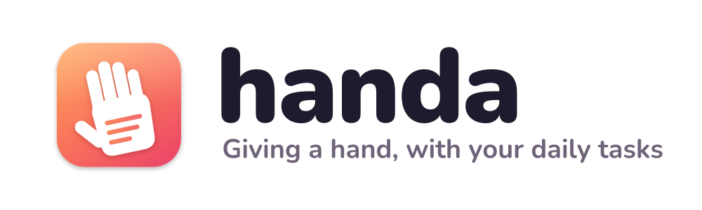
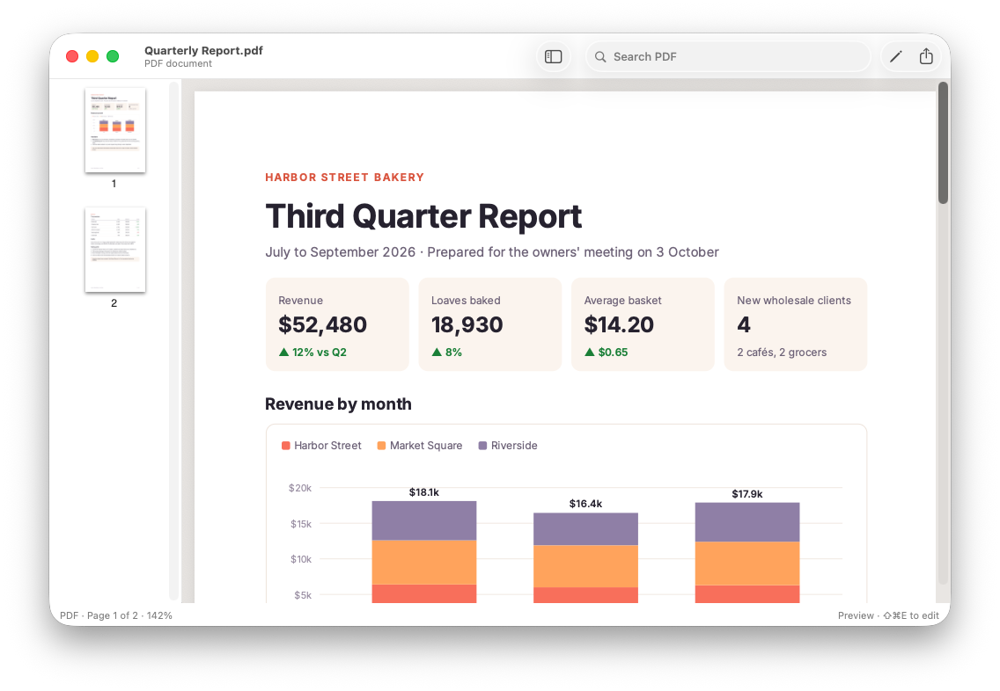
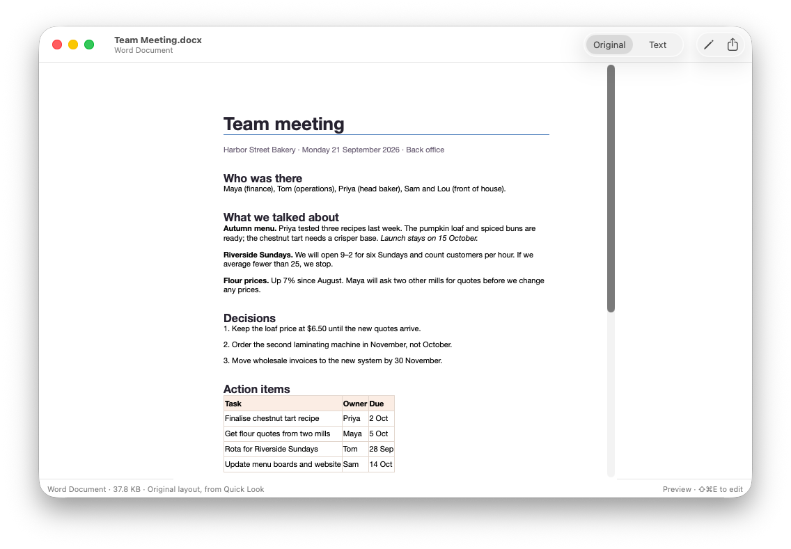
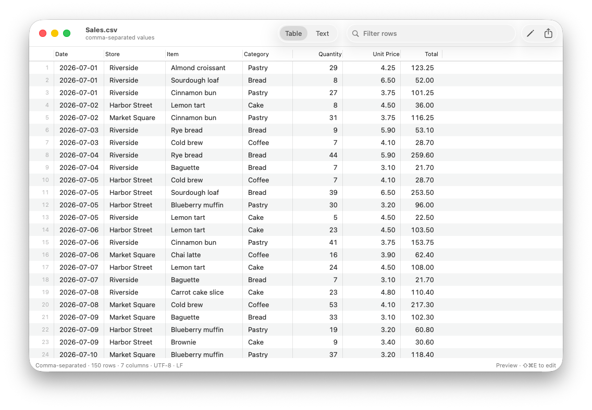
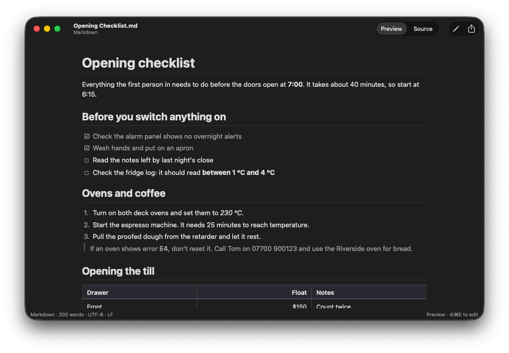
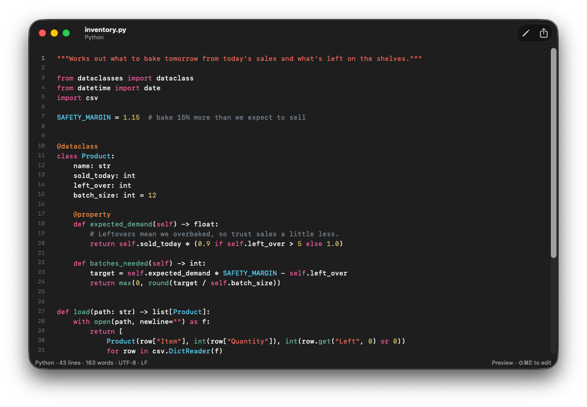
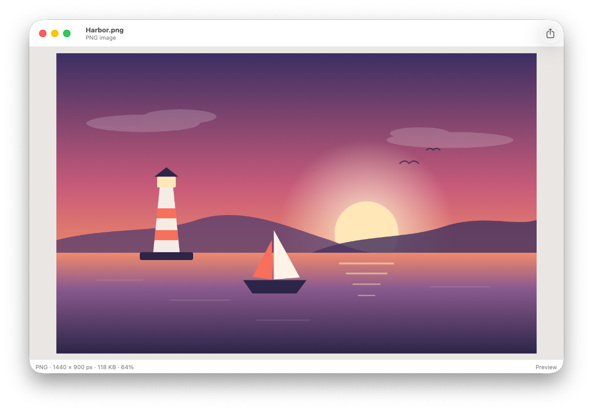
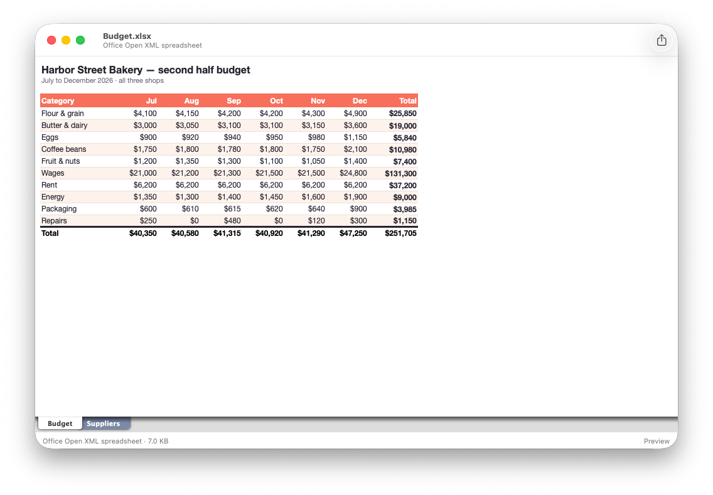
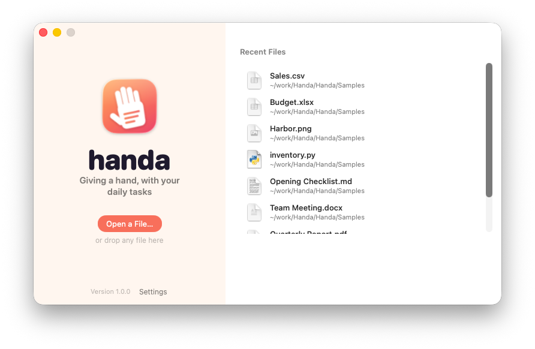
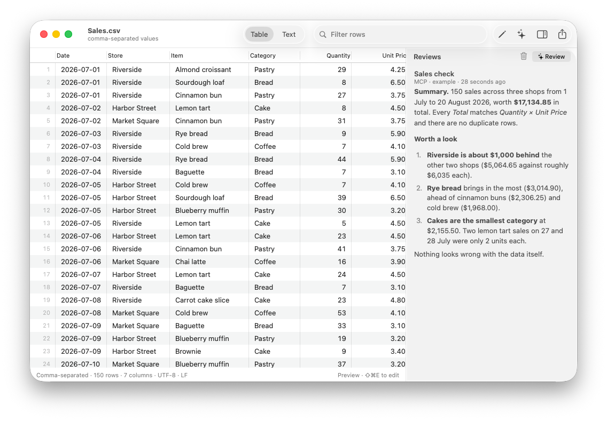

<p align="center">
  <picture>
    <source media="(prefers-color-scheme: dark)" srcset="docs/brand/banner-dark.svg">
    
  </picture>
</p>

Handa is a small, fast Mac app for opening files. Double-click a PDF, a Word document, a CSV export or a bit of code and it's on screen straight away, ready to read. When something needs fixing, press **⇧⌘E** and edit it right there.

It's plain Swift on Apple's own frameworks, with no dependencies. The whole app is __SIZE__ and shows a file about __LAUNCH__ after you double-click it.

<p align="center"></p>

## What it opens

<table>
<tr>
<td width="50%"><b>PDF</b><br>Thumbnails, search, highlight, underline, notes. Rotate or delete pages.<br></td>
<td width="50%"><b>Word, RTF, OpenDocument</b><br>Shown in their original layout. Press Edit to change the text.<br></td>
</tr>
<tr>
<td><b>CSV and TSV</b><br>A real table: sort, filter, edit cells, add rows and columns.<br></td>
<td><b>Markdown</b><br>Rendered with tables, task lists and code. Edit the source with ⇧⌘E.<br></td>
</tr>
<tr>
<td><b>Code and text</b><br>Line numbers and colours for 30+ languages. Big logs stay quick.<br></td>
<td><b>Images</b><br>Fit, zoom and pan. PNG, JPEG, HEIC, WebP, GIF, RAW and more.<br></td>
</tr>
<tr>
<td><b>Everything else</b><br>Excel, Keynote, Pages, video, audio and 3D through Quick Look. Anything unknown opens as bytes.<br></td>
<td><b>A friendly start</b><br>Recent files, drag and drop, and one click to make Handa your default viewer.<br></td>
</tr>
</table>

## Install

You need macOS 13 or later and the Xcode Command Line Tools (`xcode-select --install`).

```sh
git clone https://github.com/Michael-Duck/Handa.git
cd Handa
make install
```

That puts Handa in Applications and makes it the app that opens PDFs, Word files, CSVs, Markdown, text, code and images when you double-click them. To choose which, open **Settings → General**.

Prefer a download? Tagged versions come with a `Handa.zip` on the [Releases](https://github.com/Michael-Duck/Handa/releases) page, and Handa offers to become your default viewer the first time you open it. The app isn't notarised, so macOS will stop it at first: open **System Settings → Privacy & Security** and click **Open Anyway**.

## Using it

- Files open as a preview. **⇧⌘E** starts editing, **⌘S** saves, **Esc** closes the preview.
- **⌘]** and **⌘[** step through the other files in the same folder.
- **⌘1** and **⌘2** switch views, like a CSV's table and its raw text, or Markdown and its source.
- Nothing changes on disk until you save. Handa keeps each file's encoding, line endings and CSV quoting, and an unedited file follows changes made by other apps.

## AI, if you want it

AI is off until you turn it on in **Settings → AI**, and even then a file is only shared when you ask. Once it's on:

- **Connect Claude.** Handa has a built-in MCP server. Click **Add to Claude Desktop**, or for Claude Code run
  `claude mcp add --scope user handa -- /Applications/Handa.app/Contents/MacOS/Handa mcp`.
  Claude can then see the file you have open, read PDFs and Word documents as text, and leave reviews that appear next to the file.
- **Ask for a review.** Click **Review** in the toolbar. Handa uses your Claude API key (kept in the keychain) or any command you choose, such as `claude -p`.
- **Review automatically.** Add rules such as `*.csv` → *check the totals add up*, and matching files are reviewed when you open them. Files that haven't changed aren't reviewed twice.

<p align="center"></p>

## From the command line

```sh
Handa extract report.pdf   # print the text of a PDF, Word file, CSV and more
Handa mcp                  # run the MCP server
Handa make-default         # make Handa the default for common file types
```

`Handa` lives at `/Applications/Handa.app/Contents/MacOS/Handa`.

## Building and testing

```sh
swift test               # unit tests
make                     # builds build/Handa.app
Scripts/smoke-test.sh    # opens every file in Samples/ in the real app
```

CI runs all three on macOS 15 and macOS 26, and takes the screenshots on this page.

## License

MIT
